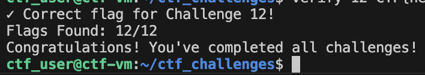

# learn 2 cloud
- This is my Learn 2 Cloud study sheet. Holding myself accountable and making sure I complete every topic. 

[Follow me on LinkedIn](https://www.linkedin.com/in/cperez37/)

# Phase 1: learning Linux and Bash

## topic 1 ✅
 + Understanding version control 
    - version control is a tool that keeps track of changes in a file so you are able to go back to older versions if needed. Able to work on new ideas in separate branches and combine changes later.
    - If different edits from people working on the file dont clash, it will merge them automatically. If they do it will let you choose how to fix them 
+ Understanding markdown
    - Its a way to format text using plain characters like ```#``` for headings, ```**``` for bold or ```-``` for lists - Its often used for README files
+ What is a git repository?
    - A storage space where files and changes for a project are kept
+ What does it mean to clone a repository?
    - Making a copy/download of a git repository including everything and its history

## topic 2 ✅
+ What is CLI
    - Its the interface which you enter commands for a computer to process something. Takes the command as inputs and executes the task for them
+ installing Azure CLI
+ configuring cloud cli with my account

## topic 3 ✅
+ what is IaC
    - Its setting up resources to manage in a file to quickly create, reuse and share anytime and start up quickly instead of clicking around a dashboard. Automatically applied by tools like terraform, ansible etc.
+ What is Terraform?
    - It a tool that lets you build, change, version control cloud and on-prem resources 
+ What does terraform init do?
    - Command initializes a working directory containing terraform config files. Its the first command that should run after writing a new terraform config or cloning a existing config. Its safe to do multiple times to bring the working directory up to date with any changes in the config 
+ What does terraform apply do?
    - executes the action in the terraform plan
+ installed Terraform 

## topic 4 ✅
+ What is SSH?
    - Secure Shell (SSH) protocol is a method for securely sending commands to a computer over the unsecured network
+ Worked on exercise for using SSH 

## topic 5 ✅
+ understanding commands to use for the CTF, including but not all: ```pwd, cd, ls, cat```
+ Network investigation commands such as ```netstat -tuln, ss -tuln, curl localhost:port``` 

## Linux command line CTF Challenge ✅
> *Not going to give away how I completed the challenges but only 
> going to writing a little of my thoughts on each of them*
+ Challenge 1: Hidden Files 
    - simple, found it quickly
+ Challenge 2: File Searching
    - took some thinking but got it done
+ Challenge 3: File Size Analysis
    - A bit challenging but eventually got it. ```grep``` helped me out with this
+ Challenge 4: User Investigation
    - got the flag once I understood what to do
+ Challenge 5: Permission Analysis
    - pretty straight forward finding the file and the flag
+ Challenge 6: Network Services
    - another straight forward challenge once interacting with it
+ Challenge 7: The Encoded Secret
    - Followed the hint to get the flag
+ Challenge 8: SSH Key Authentication
    - inspect ssh directoy like the hint suggested and found the flag
+ Challenge 9: DNS troubleshooting
    - used a tool to compare files and see whats changed 
+ Challenge 10: Remote upload
    - very simple and flag popped up right away
+ Challenge 11: Web Configuration
    - gave me a little trouble understanding why the errors kept popping up but eventually fixed it and got the flag. Had to curl to the url 
+  Challenge 12: Network Traffic Analysis
    - a little confusing without using wireshark but was able to do it



---

# Phase 2: Programming

## Topic 1: Python Basics
>going through each topic in the book: *Python Crash Course by Eric Matthes* before moving onto the next topic. 

- Chapter 1: Getting Started ✅
- Chapter 2: Variables and Simple Data Types ✅
- Chapter 3: Introducing Lists
